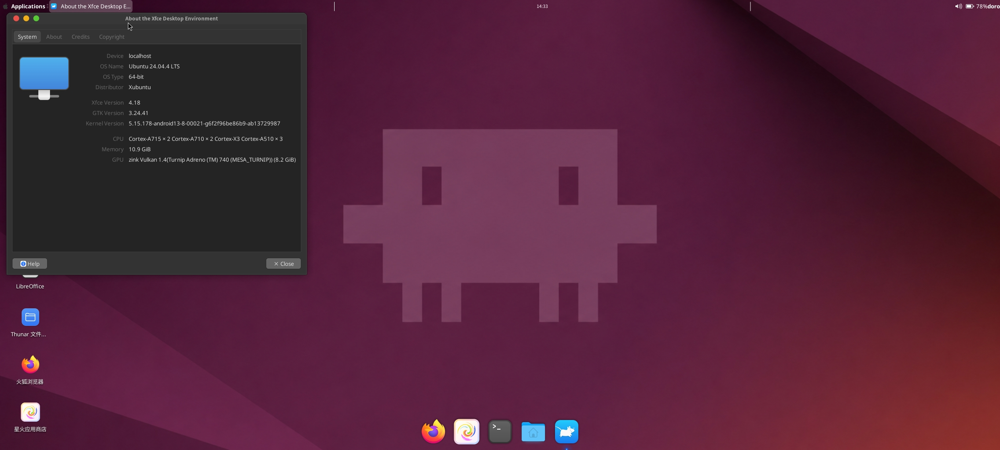
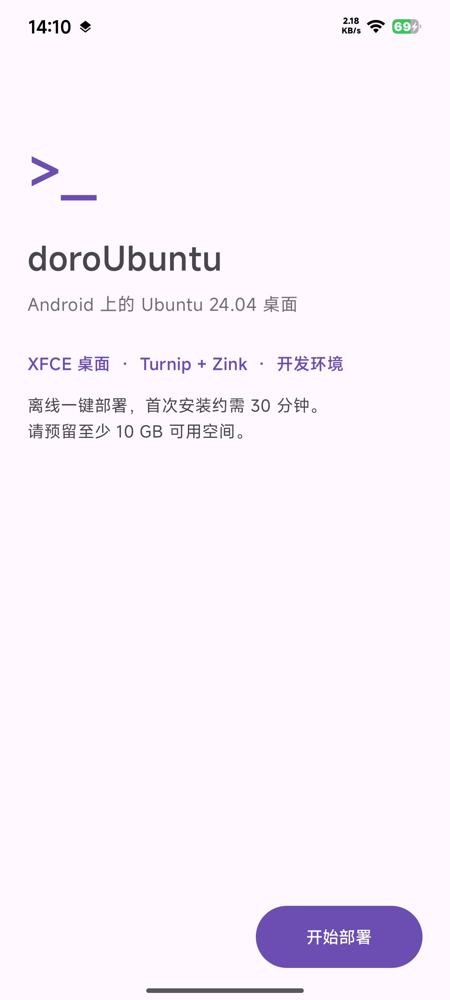
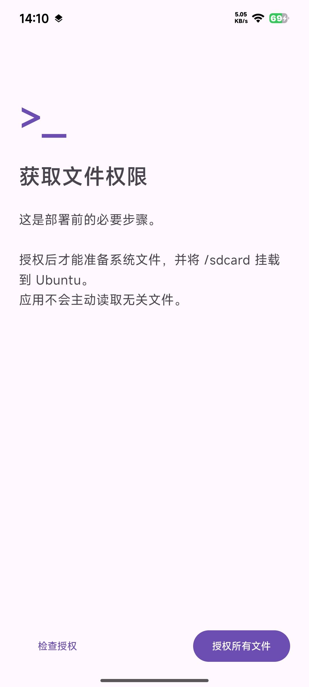
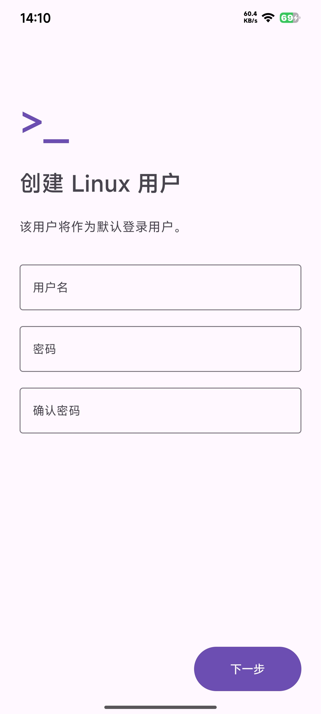
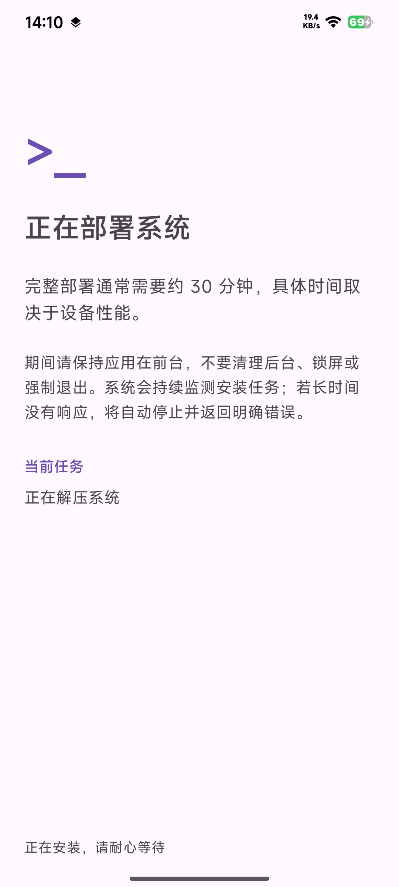
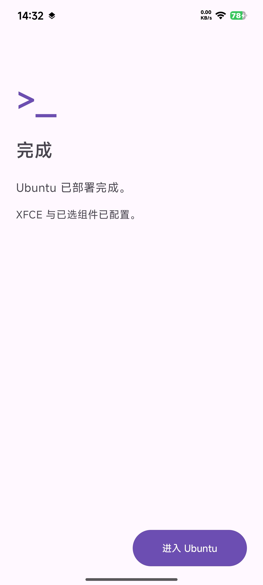
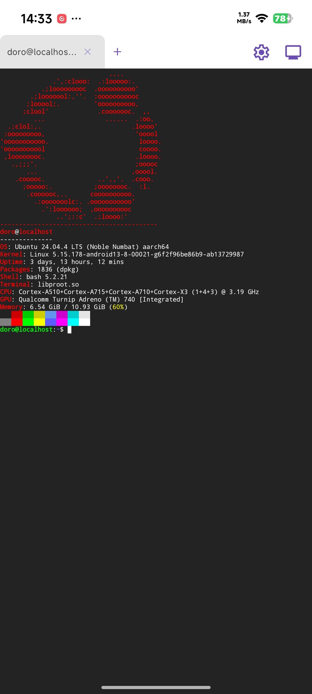

# doroUbuntu

[English](README_EN.md) | 简体中文

doroUbuntu 是安卓离线 Ubuntu 桌面环境，集成 Ubuntu 24.04、XFCE、Termux:X11 与 PulseAudio。



## 当前版本

- 版本：`1.1.9Debug`
- APK：`doroUbuntu-1.1.9Debug.apk`
- 状态：已完成全新安装验收

## 主要特性

- Ubuntu 24.04 离线初始化
- XFCE 桌面环境
- 内嵌 Termux:X11
- PulseAudio 声音桥
- Turnip 与 Zink 图形栈
- fastfetch 终端欢迎页

## GPU 方案

桌面壳使用软件渲染。应用入口通过 `/usr/local/bin/doro-gpu-run` 使用 Zink。Turnip 与 Mesa 保持不变，不全局强制 Zink，避免桌面黑屏。

```bash
doro-gpu-run glxinfo -B
```

已验证 Zink Vulkan、Turnip Adreno 740 与硬件加速。

## 桌面入口

以下六个入口支持缺失 `Exec` 自动恢复，并使用 GPU 包装器：

- Firefox
- 星火应用商店
- VLC
- LibreOffice
- GIMP
- Thunar

## 部署流程

**应用首页**



**获取文件权限**



**创建 Linux 用户**



**正在部署系统**



**Ubuntu 部署完成**



**内置终端与系统信息**



## 安装方法

1. 至少预留 10 GB 空间。
2. 安装发布页提供的 APK。
3. 打开应用并启动初始化。
4. 等待离线任务全部完成。
5. 按提示进入 XFCE 桌面。

部署期间不要清理后台，也不要强制关闭应用。

## 兼容性与限制

当前已验证 Qualcomm Adreno 740。其他 GPU 和系统尚未完整验证。

Firefox 保持软件视频解码。本版本不含实验性 MediaCodec 硬解桥。

## 下载与校验

APK 请从 GitHub Releases 下载。校验值见 `SHA256SUMS.txt`。

## 许可证

发布前请确认代码、主题、图标、驱动和预装软件的授权条款。
